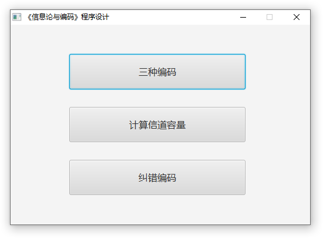
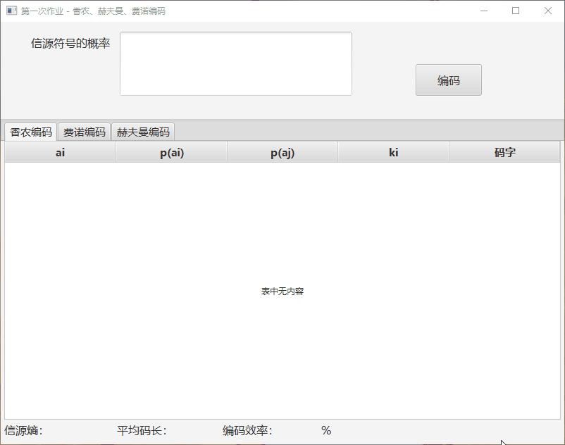
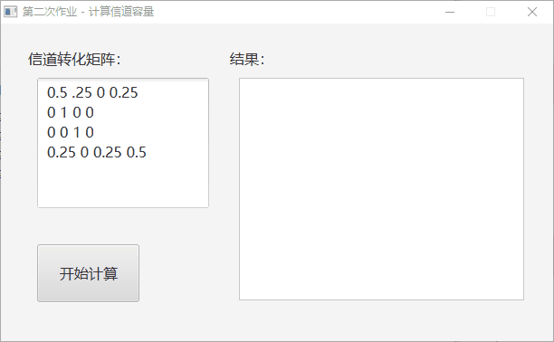
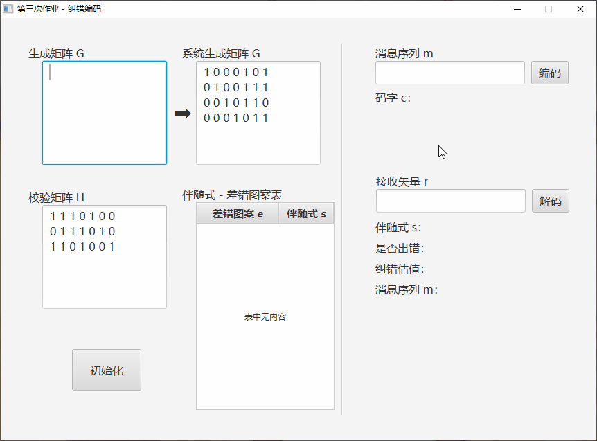

# ITAC
《信息论与编码》程序设计

- 主界面  


- 第一次作业 - 香农、赫夫曼、费诺编码


- 第二次作业 - 计算信道容量


- 第三次作业 - 纠错编码

    - 示例数据：  
        ```
        系统生成矩阵 Gs：
        1 0 0 1 1 0 1
        0 1 0 1 0 1 0
        0 0 1 0 1 1 1
        校验矩阵 H：
        1 1 0 1 0 0 0
        1 0 1 0 1 0 0
        0 1 1 0 0 1 0
        1 0 1 0 0 0 1
        ```
        ```
        系统生成矩阵 Gs：
        1 0 0 0 1 0 1
        0 1 0 0 1 1 1
        0 0 1 0 1 1 0
        0 0 0 1 0 1 1

        校验矩阵 H：
        1 1 1 0 1 0 0
        0 1 1 1 0 1 0
        1 1 0 1 0 0 1
        ```
